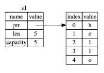
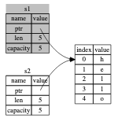

Official doc: https://doc.rust-lang.org/book/ch04-01-what-is-ownership.html

Highlights:

1. The main purpose of rust ownership is to manage heap data can help explain why it works the way it does.
2. No ownership issue with stack-only data, as the data is copied while assigning values.

Here are some of the types that implement Copy:
* All the integer types, such as u32.
* The Boolean type, bool, with values true and false.
* All the floating point types, such as f64.
* The character type, char.
* Tuples, if they only contain types that also implement Copy. For example, (i32, i32) implements Copy, but (i32, String) does not.

### Ownership Rules
* First, let’s take a look at the ownership rules. Keep these rules in mind as we work through the examples that illustrate them:
* Each value in Rust has a variable that’s called its owner.
* There can only be one owner at a time.
* When the owner goes out of scope, the value will be dropped.

String is complicated type in Rust:

Memory store graph for string `let s1 = String::from("hello");`

Then if we assign s1 to s2 `let s2 = s1;`

